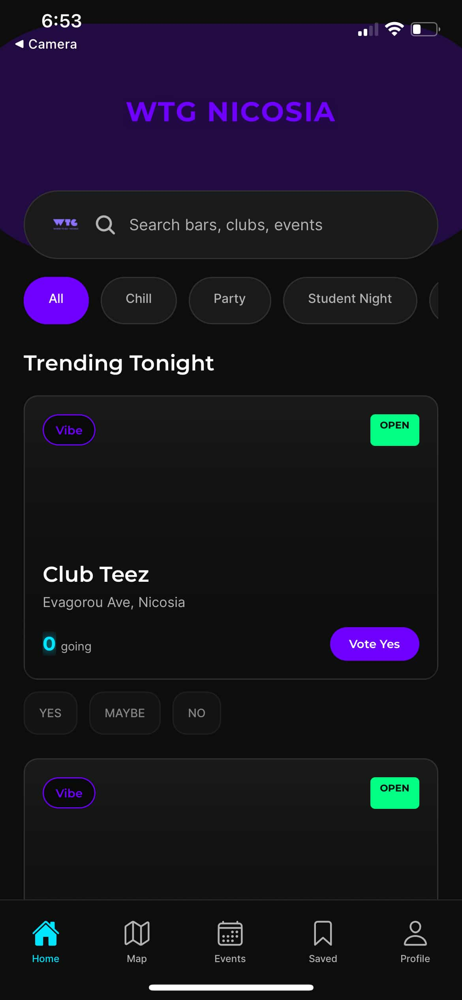
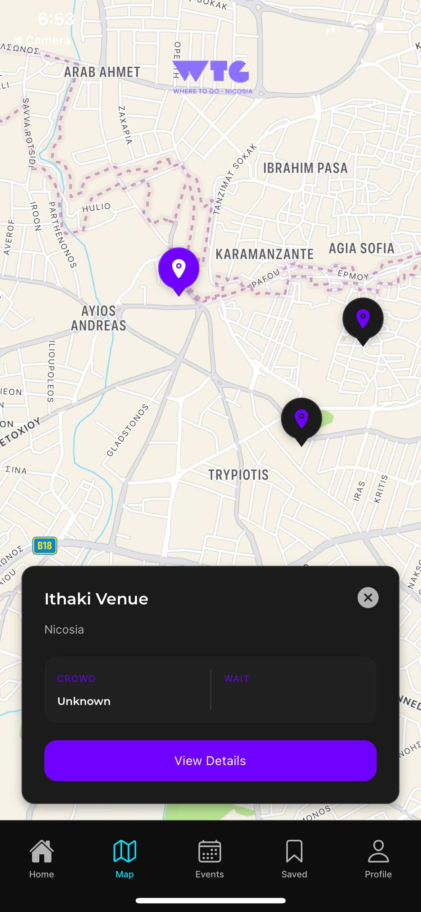
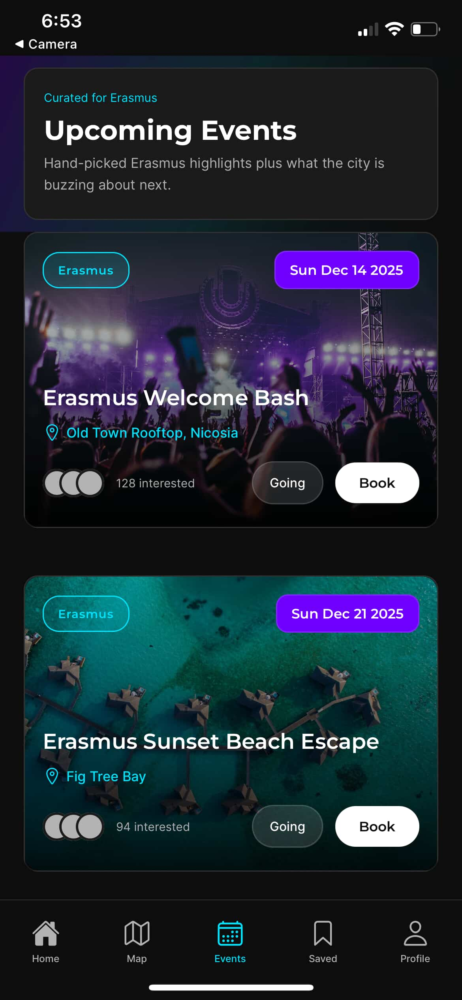
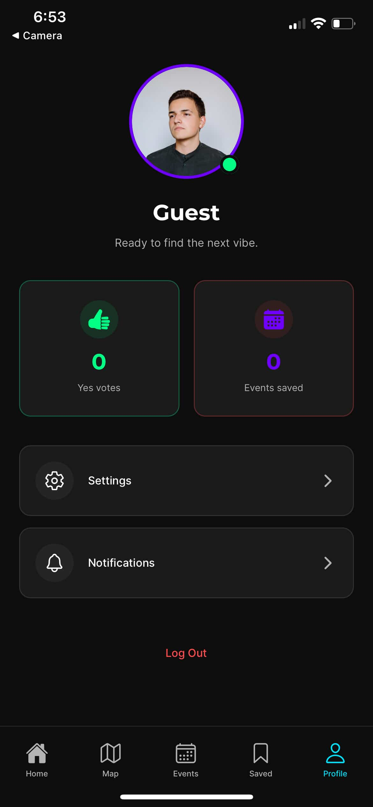

<p align="center">
  
</p>

<h1 align="center">WTG-Nicosia</h1>


<p align="center">
  Find the vibe tonight — a mobile app for international students in Nicosia to discover venues & events with real-time “who’s going” signals.
  <br />
  <strong>This is my Harvard CS50 Final Project.</strong>
</p>

<p align="center">
  
  
  
</p>

<p align="center">
  
  
  
  
</p>

## Demo
- Live: N/A
  

https://github.com/user-attachments/assets/a3651fff-2e54-4e90-8f7d-afdf8b45dc1b


## Screenshots
<p align="center">
  
  
  
  
</p>

## Features
- Trending venues feed with real-time “Yes / Maybe / No” voting signals
- Map view with venue markers and live status snapshots
- Events discovery with interest/going actions (bookings are phased)
- Auth + Profile screen (includes owner/admin-style controls in the current UI)

#### Description:

WTG-Nicosia is an Expo/React Native mobile app that helps international students in Nicosia decide where to go out. Instead of scrolling through random posts, the app tries to answer one simple question: what is the vibe tonight? You can quickly see venues, events, and live Yes / Maybe / No signals from other users, so the choice feels faster and less stressful.

The motivation came from a real student problem: going-out info is scattered, outdated, and confusing if you are new in the city. You might know the popular places by name, but you still do not know if they are busy right now, if your friends are going, or if it is even worth it. My target users are international students (and anyone new to Nicosia) who want a quick social signal, not a long review.

The app is used through bottom tabs. A normal flow is: open the app, browse Home for trending venues, check Map if you want something close, and look at Events to see what is coming up. You can interact by voting Yes/Maybe/No on venues or marking interest/going on events. Profile is where you log in/out and manage your account.

Home is the trending + voting part. Venues show up as cards with the main info (name, category, image, and current signal counts). Voting is meant to be lightweight: one tap and you immediately see the counts change, so it feels live and social. This is not perfect science, but it is a good shortcut for students who just want to decide fast.

Map is handled in `screens/CyprusMapScreen.js` with venue markers and quick status snapshots. I also made a separate `screens/CyprusMapScreen.web.js` because the web build does not behave exactly like native maps. One challenge here was coordinates: at first I copied the wrong format from Google (big numbers that were not latitude/longitude), so markers showed in the wrong place. After switching everything to normal lat/long, the map finally matched real Nicosia.

Events are in `screens/EventsScreen.js` and focus on upcoming event discovery. Users can scroll through event cards, see dates and details, and tap interest/going actions. I say "bookings are phased" because a full guest-list/booking flow is bigger, and I did not want it to block the core experience. The events feature still supports the main goal: seeing what is happening and reacting quickly.

Profile and roles are in `screens/ProfileScreen.js` plus the auth context. Users can authenticate, edit profile details, and manage their session. I also included owner/admin-style controls in the UI because I wanted a path for venue managers to update their own info (like status/occupancy tools). Even if it is not fully production-ready, it shows the direction of the app and forced me to think about permissions early.

The backend uses Supabase for Auth, Postgres, Row Level Security (RLS), Realtime, Storage, and RPC. The client connects using `EXPO_PUBLIC_SUPABASE_URL` and `EXPO_PUBLIC_SUPABASE_ANON_KEY`. Admin/service role keys are not for the client, so I kept them out. Realtime is important because it makes votes feel live instead of waiting for refresh. Keeping the URL/key in env vars also makes it easy to swap between a dev and production Supabase project without touching the code.

Code is organized by responsibility:
- `App.js` (entry point, splash/fonts, navigation shell, wraps `AuthProvider`).
- `screens/` (`HomeScreen.js`, `CyprusMapScreen.js`, `CyprusMapScreen.web.js`, `EventsScreen.js`, `ProfileScreen.js`, `SplashScreen.js`).
- `components/` (`BottomNav.js`, `VenueCard.js`, `EventCard.js`, `SearchBar.js`).
- `lib/` (`supabaseClient.js`, `authContext.js`, `supabaseApi.js`, `mockData.js`).
- `supabase/` (`schema.sql`, `migrations/`, `seed.dev.sql`).
- Extras: `constants/theme.js`, `assets/`, `md files/`, `SECURITY.md`, `CONFIG_INPUTS.md`.

To run it, install dependencies with `npm install`, copy `.env.example` to `.env`, and set the required Supabase env vars. Then run `npm start` and open the app with Expo Go or an emulator. For web, use `npm run web`, but keep in mind that map behavior differs, which is why there is a web-specific map screen.

Design-wise, I chose Expo because it let me move fast and test on my phone, and Supabase because I wanted a real backend without building auth and realtime from scratch. The main tradeoff is scope: I avoided a full booking flow and I dropped a group chat idea because it would add traffic, moderation, and server complexity. My biggest mistake early on was not planning clearly, so I had to redo decisions and it was frustrating. After I made a simple PRD/flowchart and split things into phases, development got smoother. I also hit a few Expo version mismatches and missing libraries. The lesson was to slow down, read the logs, and make sure the SDK and libraries match. Next, I would add moderation, notifications, and more complete venue owner tools.
## Tech Stack
- App: Expo (React Native), React
- Maps: `react-native-maps`
- Backend: Supabase (Postgres + RLS, Auth, Realtime, Storage, RPC)
- Scripts: TypeScript utilities in `scripts/` and `utils/`

## Getting Started

### Prerequisites
- Node.js (LTS recommended)
- Expo Go (or an Android/iOS simulator/device)

### Install
```bash
npm install
```

### Environment variables
Copy the example file and fill it with your Supabase project values:
```bash
copy .env.example .env
```

Required (client):
- `EXPO_PUBLIC_SUPABASE_URL`
- `EXPO_PUBLIC_SUPABASE_ANON_KEY`

Admin-only (never in the client app, never commit real values):
- `SUPABASE_SERVICE_ROLE_KEY`

### Run
```bash
npm start
```

Other commands:
```bash
npm run android
npm run ios
npm run web
```

## Backend (Supabase)
- Schema & seeds live in `supabase/` (`supabase/schema.sql`, `supabase/migrations/`, `supabase/seed.dev.sql`)
- Local dev (requires Supabase CLI):
```bash
supabase start
supabase db reset
```

## Docs
- PRD: `md files/PRD.md`
- Backend overview: `md files/BACKEND_OVERVIEW.md`
- Supabase implementation plan: `md files/README.md`
- Inputs checklist: `CONFIG_INPUTS.md`
- Security notes: `SECURITY.md`

## Project Structure
- `App.js` app entry
- `screens/` main screens
- `components/` shared UI components
- `lib/` Supabase client + API + auth context
- `supabase/` database schema, migrations, seeds
- `assets/` images, icons, mockups

## Security
See `SECURITY.md` (especially about Supabase keys + RLS).

## License
MIT — see `LICENSE`.
